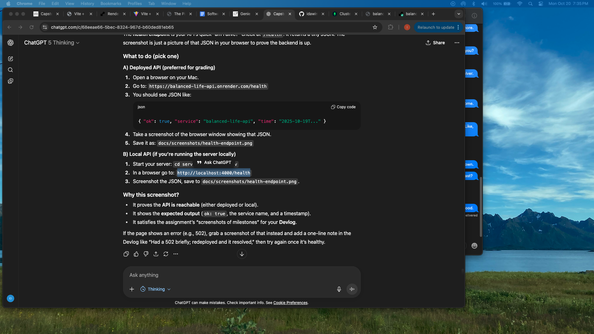

# Devlog — Balanced Life

This log documents weekly progress, decisions, challenges, and screenshots.

Repo: https://github.com/<your-username>/balanced-life  
Health check: https://balanced-life-api.onrender.com/health

---

## Week 1 — Proposal & Planning
**Planned**
- Idea: Menopause-focused wellness tracker (mobile-first).
- Users: People in menopause who want simple daily logs + symptom focus.
- Stack: Expo/React Native (mobile), Node/Express + TypeScript (API), MongoDB Atlas.
- Differentiator: Menopause-specific fields; wearable integration later.

**Done**
- Wrote proposal and received instructor approval.

---

## Week 2 — Design
**Architecture**
- Mobile: **Today** (form) + **History** (list + chart).
- API: `/daily` routes, Zod validation, Mongoose models.
- Data flow: Mobile → API → MongoDB; History fetch (last 14 days).

**Decisions**
- Manual entry first (leave room for future Oura integration).
- Auth deferred until MVP (later added lightweight email login).

---

## Week 3 — Development
**Server**
- Express + TypeScript project.
- Mongoose model `DailyMetrics`.
- Routes:
  - `POST /daily/:date` (upsert)
  - `GET /daily?from=YYYY-MM-DD&to=YYYY-MM-DD`
- Validation: Zod schemas (shaped for metrics, menopause, supplements).

**Mobile**
- Expo scaffold.
- Today form with `react-hook-form`.
- History list + 14-day line chart (Sleep/Mood toggle) via `react-native-chart-kit`.

**Challenges & Fixes**
- MongoDB Atlas URI + credentials -> fixed SRV connection string.
- TypeScript editor errors -> aligned VS Code TS version + `@types/*`.

**Notes / Screenshots**
- Today form  
  
  
- History with chart (Sleep/Mood toggle)  
  
  

---

## Week 4 — Testing & Deployment
**Testing**
- Jest + Supertest configured for the API.
- Current coverage (sample tests):
  - `GET /health` returns `{ ok: true }`.
  - Zod validation guards for `/daily` payloads.
  - Auth middleware behavior for protected routes.
  - Email login input validation.
  - From server/: npm test
- ✅ **All tests passing (8/8).**

**Deployment**
- API deployed to **Render** (Web Service).
- Mobile app reads `EXPO_PUBLIC_API_URL` (can point to local dev or Render).

**Challenges**
- Render build errors: missing `@types/*` → add dev deps to install on build.
- Node EOL warning → set `NODE_VERSION=20`.

**Notes / Screenshots**
- Render service (healthy)  
  
- Health endpoint JSON  
  
- Test run (green)  
  

---

## Week 5 — Polish & Auth
**Lightweight Auth**
- Added simple email login (`POST /auth/login`) that creates/returns a `userId`.
- Mobile stores `userId` in AsyncStorage and gates app screens.
- Kept logout for testing.

**UI Polish**
- Introduced a small design system (colors, radii, shadow).
- Replaced raw inputs with `LabeledInput`, sections with `SectionCard`.
- Added a login hero image + tagline for a friendlier first run.

**Screenshots**
- Login hero + email form  
  

---

## Learnings & Next Steps
**Learned**
- End-to-end flow: mobile → API → DB → chart.
- Practical TypeScript setups (app vs tests) and Zod validation.
- Cloud deploy troubleshooting (CORS, types, Node versions).

**Planned Improvements**
- Swap lightweight login for provider auth (Google/Apple) or magic links.
- Wearable integration (Oura OAuth) for automatic metrics.
- More charts (HRV trends, symptom correlations).
- Push notifications / reminders.
- More tests covering `/daily` success & error paths.

---

## Milestones (dates)
- **2025-10-18–19:** Mobile scaffold, Today form, server routes, MongoDB connect.
- **2025-10-19:** History chart + toggle; Render deploy; initial Jest test.
- **2025-10-20:** Lightweight email login, UI polish, test suite expanded (8 passing).
