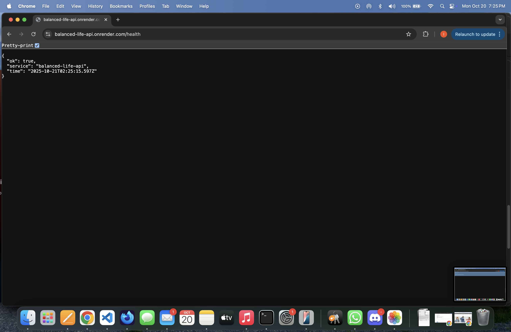
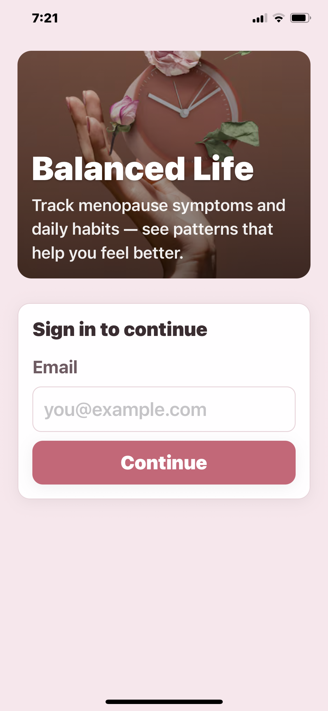
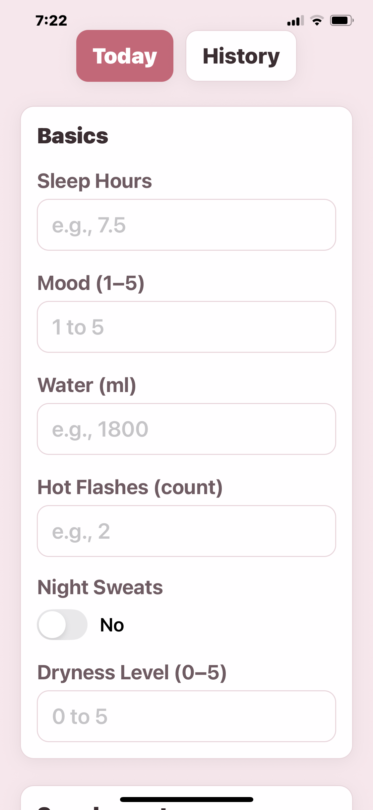
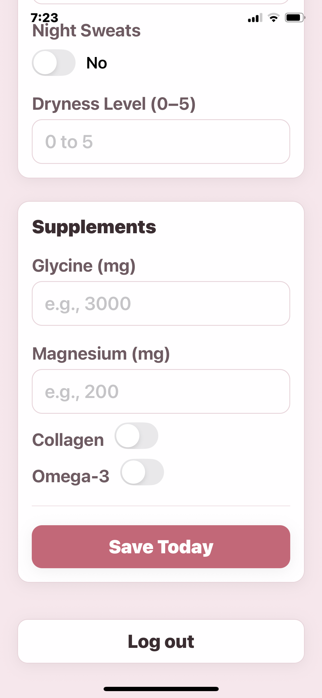
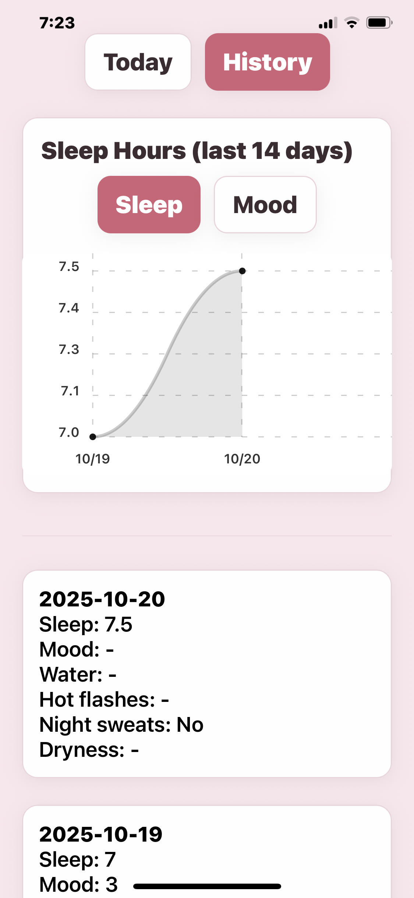
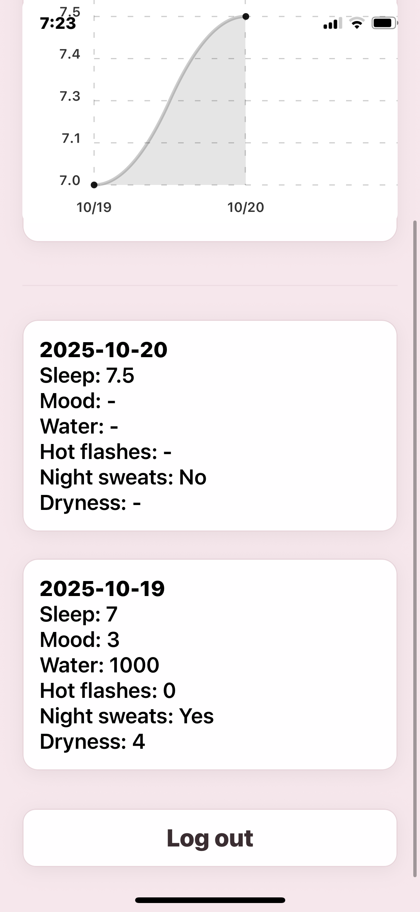
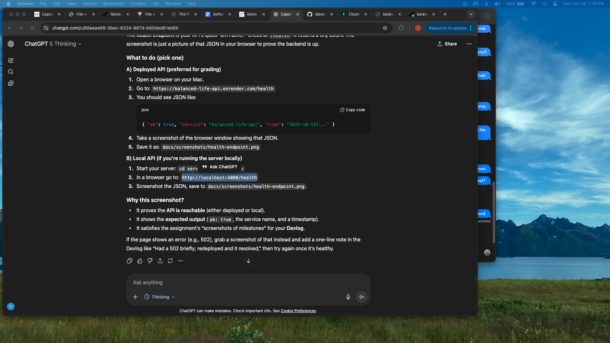

# Balanced Life — Menopause-Focused Wellness App

A simple mobile app (Expo/React Native) + Node/Express API + MongoDB that tracks daily wellness with a focus on menopausal symptoms (sleep, mood, water, hot flashes, etc.). Includes a 14-day history view with a basic chart and a deployed API.

---

## Submission Info (Quick Start for Graders)

**Live API (Render):** https://balanced-life-api.onrender.com  
- Health check: https://balanced-life-api.onrender.com/health

**Mobile app (Expo) — how to run:**
1. Install:
   ```bash
   cd mobile
   npm install

---

## Live Application

- API (health check): https://balanced-life-api.onrender.com/health
- Mobile app: open in Expo Go (see instructions below)

---

## Project Overview

Balanced Life lets users quickly log daily wellness metrics and menopause-specific symptoms. Data is stored in MongoDB Atlas and retrieved for a simple 14-day history view with a chart that can toggle between Sleep and Mood.

Why it’s different: Many wearables (e.g., Oura) don’t natively track menopause-specific symptoms well. This app focuses on those signals and makes them easy to log manually, while remaining open to wearable integration later.

---

## Features

- Today screen to log:
  - Sleep hours, Mood (1–5), Water (ml)
  - Menopause: Hot flashes (count), Night sweats (toggle), Dryness level (0–5)
  - Supplements: Glycine (mg), Magnesium (mg), Collagen (toggle), Omega-3 (toggle)
- History screen (last 14 days):
  - List of entries
  - Line chart with a toggle for Sleep / Mood
- Backend API with MongoDB Atlas (Mongoose + Zod validation)
- Deployed API on Render
- Tests: Jest + Supertest example for /health

---

## Technologies Used

- Mobile: React Native (Expo), react-hook-form, react-native-chart-kit, dayjs, Axios
- Server: Node.js, Express, TypeScript, Mongoose, Zod, Jest, Supertest
- Database: MongoDB Atlas
- Deployment: Render (Web Service)

---

## Installation (Local)

### Prerequisites
- Node 20.x
- A MongoDB Atlas connection string

### 1) Clone and open

    git clone <your repo url>
    cd balanced-life

### 2) Server (API)

    cd server
    cp .env.example .env   # then edit .env and paste your real MONGO_URI
    npm install
    npm run dev            # starts http://localhost:4000

Example .env contents:

    PORT=4000
    MONGO_URI=your-atlas-connection-string

### 3) Mobile (Expo app)

    cd ../mobile
    # Create .env with your API URL:
    # For local dev on the same Wi-Fi, use your computer’s LAN IP:
    # EXPO_PUBLIC_API_URL=http://YOUR-LAN-IP:4000
    #
    # Or use the deployed API:
    # EXPO_PUBLIC_API_URL=https://balanced-life-api.onrender.com
    npm install
    npm run start          # open in Expo Go or simulator

---

## Usage

1. Start the server first (local or use the live URL).
2. Start the mobile app in Expo Go.
3. Go to Today, enter values, tap Save Today.
4. Switch to History to see entries and the chart (toggle Sleep/Mood).

---

## Screenshots

### API Health (deployed)
This confirms the backend API is reachable.


### Mobile — Login


### Mobile — Today Form
Users can log sleep, mood, water, and menopause-specific symptoms.



### Mobile — History + Chart
Toggle Sleep/Mood for the last 14 days and view entries.



### Tests — Passing
Server tests (Jest + Supertest) showing green.


---

## API Endpoints (summary)

- GET /health → returns JSON like:
  
      { "ok": true, "service": "balanced-life-api", "time": "2025-10-19T00:00:00.000Z" }

- POST /daily/:date (YYYY-MM-DD) → upsert a day. Example body:
  
      {
        "metrics": { "sleepHours": 7.5, "mood": 4, "waterMl": 1800 },
        "menopause": { "hotFlashCount": 2, "nightSweats": true, "drynessLevel": 2 },
        "supplements": { "glycineMg": 3000, "magnesiumMg": 200, "collagen": true, "omega3": true }
      }

  Response:
  
      { "ok": true, "data": { "...document..." } }

- GET /daily?from=YYYY-MM-DD&to=YYYY-MM-DD → range for charts/history. Response:
  
      { "ok": true, "count": 14, "data": [ { "...day 1..." }, { "...day 2..." } ] }

---

## Design Notes (Architecture)

- Mobile (Expo/React Native)
  - Screens: “Today” (form) and “History” (list + chart)
  - Form state via react-hook-form
  - HTTP via Axios helper (src/lib/api.ts) using EXPO_PUBLIC_API_URL
  - Chart via react-native-chart-kit

- Server (Node/Express/TypeScript)
  - routes/daily.ts for POST/GET endpoints
  - Validation with Zod
  - Persistence with Mongoose (models/DailyMetrics.ts)
  - app.ts exports the Express app (for tests)
  - index.ts connects to Mongo and starts the server

- Data flow
  - Mobile posts a daily entry to /daily/:date
  - Mobile fetches the last 14 days from /daily?from=...&to=... for history & chart

---

## Testing

From server/:

    npm test

Included example (Jest + Supertest):
- GET /health returns { ok: true } and the expected service name.

---

## Future Improvements

- Lightweight sign-in (send x-user-id header) or full auth provider
- Wearable integration (Oura/OAuth) for automatic metrics
- More visualizations (HRV, symptom correlations)
- Push notifications/reminders
- More tests (POST/GET /daily, validation error paths)

---

## Devlog (highlights)

- 2025-10-18–19: Mobile scaffold, Today form, server API, MongoDB Atlas connect.
- 2025-10-19: History list + chart; Sleep/Mood toggle; deployed API on Render; first Jest test.

(Add screenshots before submission: Today form, History with chart, passing tests, Render dashboard.)
